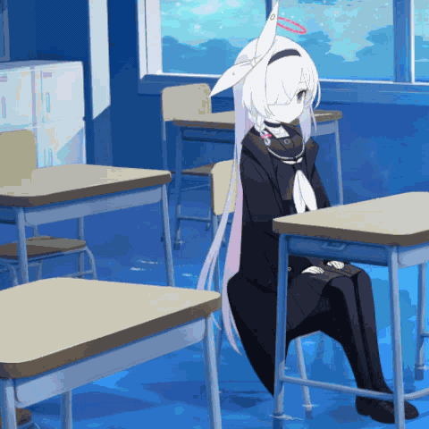

# ba-click-fx — Blue Archive Click Effect and Cursor Trail for Web

[](LICENSE)
[](https://github.com/CialloKing/ba-click-fx/actions)
[](https://www.npmjs.com/package/ba-click-fx)
[](https://www.npmjs.com/package/ba-click-fx)
[](https://chromewebstore.google.com/detail/clphaaacolnifhgmeblfeofapccgoami) [](https://microsoftedge.microsoft.com/addons/detail/ba-click-fx/gocfepocmghimclocjafcihcplnpjpkc) [](https://addons.mozilla.org/zh-CN/firefox/addon/ba-click-fx/)

> 📖 [English version](./README.en.md)

**从 Blue Archive Unity UI/FX_Touch 逐参数移植的网页点击特效与光标拖尾动画库。**

`ba-click-fx` 将游戏《蔚蓝档案》的 `FX_Touch.prefab` 中 ParticleSystem 和 TrailRenderer 的完整参数——颜色曲线、大小曲线、旋转速度、溶解阈值、HDR 强度、TrailRenderer 时间与宽度——逐项还原到 Web。默认由 **纯 WebGL2** 接管完整 Scene、Coverage 与 MXFinalBloom；能力不足时自动回退 Canvas 2D、软件 Bloom 与原生辉光。零外部运行时依赖。

A parameter-level port of the **Blue Archive** UI click effect and cursor trail from Unity to the web. **Full WebGL2** by default, automatic Canvas 2D and Bloom fallbacks, and zero external runtime dependencies.

**在线演示：** [ba-click-fx.cialloking.top](https://ba-click-fx.cialloking.top)

> 🖱 点击、拖拽或移动鼠标即可预览特效。Click, drag, or move your mouse on the demo page to preview.

<p align="center">
  
  &nbsp;&nbsp;
  
</p>
<p align="center"><sub>ba-click-fx 项目演示（左） · 游戏内效果参考（右，仅用于效果对比）</sub></p>

---

## 目录

- [特性](#特性)
- [使用方式](#使用方式)
- [常见用法](#常见用法)
- [API 文档](#api-文档)
- [效果说明](#效果说明)
- [和其他项目的区别](#和其他项目的区别)
- [项目结构](#项目结构)
- [开发说明](#开发说明)
- [致谢](#致谢)
- [许可](#许可)

---

## 特性

- 从 Unity FX_Touch.prefab 逐参数移植，非"相似风格"模拟
- 溶解圆环（MeshTri）、中心光盘（ring）、点击碎片（Ring 3/4）、拖尾轨迹（TrailRenderer）
- 所有粒子参数锁定为游戏原始值：颜色渐变、大小曲线、旋转速度、溶解阈值、HDR 强度
- Canvas 2D 与纯 WebGL2 两套清晰几何路径，无外部运行时依赖
- 五种展示页渲染选择：纯 WebGL2（默认）、WebGL2 Bloom、软件 Bloom、原生辉光、Legacy
- 默认使用完整 WebGL2 Scene；不支持时自动回退 Canvas 2D、软件 Bloom，再回退原生辉光
- 支持浏览器插件、npm、CDN、直接下载四种接入方式
- 演示默认主题色 `#4ca7ff`，支持自定义 HSL hue 偏移
- 可调参 API：运行时修改圆环 HDR、半径、宽度、寿命、碎片数量、拖尾宽度、Bloom 强度等
- 粒子尺寸随画布高度持续缩放，保持与 Unity UI 相同的相对比例

---

## 使用方式

### 1. 浏览器插件

不想写代码？直接安装浏览器扩展，即可为所有网页添加蔚蓝档案风格点击特效和光标拖尾：

| 商店 | 安装链接 |
|------|----------|
| **Chrome** | [Chrome Web Store](https://chromewebstore.google.com/detail/clphaaacolnifhgmeblfeofapccgoami) |
| **Edge** | [Edge Add-ons](https://microsoftedge.microsoft.com/addons/detail/ba-click-fx/gocfepocmghimclocjafcihcplnpjpkc) |
| **Firefox** | [Firefox Add-ons](https://addons.mozilla.org/zh-CN/firefox/addon/ba-click-fx/) |

- 安装后默认开启，无需给每个网站添加脚本
- 点击特效与光标拖尾可分别开关，可按网站临时禁用
- 可调整主题颜色、透明度、特效大小和画质
- Canvas 位于 Shadow DOM 内，不影响页面布局
- 纯本地渲染，不请求远程资源

源代码：[ba-click-fx-extension](https://github.com/CialloKing/ba-click-fx-extension)

### 2. npm 安装

```bash
npm install ba-click-fx
```

```js
import { BAClickFX } from 'ba-click-fx';
const fx = new BAClickFX();
```

### 3. CDN 引入

```html
<script src="https://cdn.jsdelivr.net/npm/ba-click-fx@1.2.13/dist/ba-click-fx.iife.js"></script>
<script>
  const fx = new BAClickFX.BAClickFX();
</script>
```

IIFE 构建会把模块对象暴露为全局变量 `BAClickFX`，构造函数位于 `BAClickFX.BAClickFX`。

### 4. 直接下载

从 [GitHub Releases](https://github.com/CialloKing/ba-click-fx/releases) 下载构建产物（`ba-click-fx.js`、`ba-click-fx.iife.js`、`ba-click-fx.cjs`、`ba-click-fx.d.ts`）：

```html
<canvas id="myCanvas"></canvas>
<script type="module">
  import { BAClickFX } from './ba-click-fx.js';
  const fx = new BAClickFX({ target: '#myCanvas' });
</script>
```

---

## 常见用法

挂载到指定 canvas：

```js
const fx = new BAClickFX({ target: '#myCanvas' });
```

手动触发点击特效：

```js
fx.boom(window.innerWidth / 2, window.innerHeight / 2);
```

页面卸载时销毁：

```js
fx.destroy();
```

---

## API 文档

### 构造函数

```ts
new BAClickFX(options?: {
  target?: string | HTMLElement,   // 挂载目标，默认全屏
  scale?: number,                  // 全局缩放，默认 1
  opacity?: number,                // 不透明度 0~1，默认 1
  outputCompositing?: 'scene' | 'transparent-overlay', // 输出合成，默认 scene
  clickEnabled?: boolean,         // 启用点击特效，默认 true
  trailEnabled?: boolean,         // 启用拖尾，默认 true
  trailAlways?: boolean,          // 移动鼠标即显示拖尾（无需按下），默认 false
  inputSource?: 'dom' | 'manual', // 输入来源，默认 dom
  clickTimeScale?: number,        // 点击时间倍率，默认 1
  trailTimeScale?: number,        // 拖尾时间倍率，默认 1
  effectBackend?: 'canvas2d' | 'webgl2' | 'auto', // 完整特效后端，默认 webgl2
  renderingMode?: 'enhanced' | 'legacy', // 渲染模式，默认 enhanced
  bloomBackend?: 'auto' | 'software' | 'webgl2' | 'native', // Bloom 后端，默认 webgl2
  softwareBloomEnabled?: boolean, // 兼容旧 API：true 等同 software，false 等同 native
  isolatedCompositing?: boolean,  // 隔离合成，默认 false；true 为非游戏白底兼容选项
  lightBackgroundContrastAlpha?: number, // 浅色背景兼容层强度，默认 0
  maxDpr?: number,                // 最大设备像素比，默认 2
  touchAction?: string,           // Canvas touch-action，默认 'auto'
  inputFilter?: (e: PointerEvent) => boolean,
})
```

`effectBackend` 决定清晰几何与 Bloom 是否全部由 WebGL2 接管；Canvas 2D 路径再通过 `bloomBackend` 选择 Bloom 实现。展示页提供五种直观组合：

| 展示页选项 | API 配置 | 说明 |
|---|---|---|
| 纯 WebGL2 | `{ effectBackend: 'webgl2', renderingMode: 'enhanced', bloomBackend: 'webgl2' }` | 默认；完整 Scene、Coverage 与 MXFinalBloom 均在同一个 WebGL2 输出中完成；失败时回退 Canvas 2D 链 |
| WebGL2 Bloom | `{ effectBackend: 'canvas2d', renderingMode: 'enhanced', bloomBackend: 'webgl2' }` | Canvas 生成清晰 Scene，GPU 执行游戏 MXFinalBloom 与最终输出 |
| 软件 Bloom | `{ effectBackend: 'canvas2d', renderingMode: 'enhanced', bloomBackend: 'software' }` | 参考/兼容实现，使用 Canvas 2D 像素回读和全视口 Float32 缓冲 |
| 原生辉光 | `{ effectBackend: 'canvas2d', renderingMode: 'enhanced', bloomBackend: 'native' }` | 使用 Canvas 2D `shadowBlur`，开销较低但观感与后处理 Bloom 不同 |
| Legacy | `{ effectBackend: 'canvas2d', renderingMode: 'legacy' }` | 使用 Unity 材质能量和纹理轮廓，以 Canvas `shadowBlur` 提供兼容辉光；此时忽略 Bloom 后端 |

展示页在五档渲染选项之外提供独立的“隔离合成”开关。该开关默认关闭，与渲染后端正交；它只控制多张 Canvas 的最终 CSS 合成边界，不改变 Bloom 阈值、模糊或颜色计算，也不是降低 Bloom 计算量的性能开关。

`bloomBackend: 'auto'` 会优先尝试 WebGL2，失败时依次使用软件 Bloom 和原生辉光。默认值 `'webgl2'` 采用相同回退链；显式选择 `'software'` 时，像素回读不可用则回退原生辉光。为兼容 1.2.13 及更早版本，构造参数或 `createConfig()` 只要显式提供 `bloomBackend` / `softwareBloomEnabled` 而未提供 `effectBackend`，就继续选择 Canvas 2D 完整特效路径；显式 `effectBackend` 始终优先。若同时传入 `bloomBackend` 和旧字段 `softwareBloomEnabled`，以 `bloomBackend` 为准；旧字段仍保持 `true` 等价于 `'software'`、`false` 等价于 `'native'`。

`outputCompositing: 'scene'` 保持面向普通网页和游戏场景的既有输出。`'transparent-overlay'` 面向 WebView2、Electron 等透明桌面窗口：HDR RGB 继续驱动 Bloom，最终 Alpha 则由几何 Coverage、生命周期 Alpha 与 `opacity` 决定，避免高 HDR 圆盘把桌面完全遮住。该选项不改变 Bloom 阈值或发射强度。

`isolatedCompositing` 默认是 `false`，各 Canvas 直接挂载到目标容器或页面。设为 `true` 后，库拥有的主特效层、WebGL2 层和浅色背景兼容层会先在透明隔离组内解析，再将整个组覆盖到页面上，避免浏览器分别把兼容层与纯白页面合成后丢失蓝青色对比。各渲染器内部已经完成 Unity 加色并输出预乘 Alpha，外层不再使用会二次增亮的 CSS `plus-lighter`。隔离合成是非游戏的网页白底兼容选项，可通过 `updateConfig()` 在运行时切换。

纯 WebGL2、WebGL2 Bloom、场景背景 Final Pass 和隔离合成都需要库拥有 DOM 覆盖层。若 `target` 是一个已有的 `<canvas>`，库无法安全插入额外的 WebGL2、对比或隔离层，因此完整特效的 `'webgl2'` / `'auto'` 会回退 `canvas2d`，Bloom 的 `'webgl2'` / `'auto'` 会回退软件 Bloom，`isolatedCompositing` 也会被强制降级为 `false`；`getConfig()` 返回降级后的实际配置。默认全屏覆盖层不受此限制。普通容器也可以使用，但容器必须自行建立定位上下文（通常设置 `position: relative`），库不会静默修改宿主样式。

隔离根按 `BAClickFX` 实例独立创建和销毁。同一页面的多个隔离实例不会跨根混合内部兼容层；一个实例切换模式或销毁也不会移动、删除其他实例的 Canvas。

纯白背景需要额外对比度时，可显式启用两项网页兼容选项：

```js
const fx = new BAClickFX(
{
  isolatedCompositing: true,
  lightBackgroundContrastAlpha: 0.35,
});
```

### 场景背景与线性合成

`setSceneBackground()` 可把特效下方的真实不透明栅格场景交给渲染器。纯 WebGL2 和 WebGL2 Bloom 会在同一线性 HDR Scene 中合成背景、Coverage、清晰特效与 Bloom；提供背景时，原生辉光和 Legacy 通过 Canvas Final Pass 使用同一背景和覆盖率语义，避免不同模式在桌面亮度与透明度上产生分歧。软件 Bloom 仍使用普通 DOM 背景路径。

```js
const image = new Image();
image.crossOrigin = 'anonymous';
image.src = 'https://example.com/background.jpg';
await image.decode();

fx.setSceneBackground(image, { fit: 'cover' });
// 恢复普通透明 DOM 背景，并释放仅供 Canvas Final Pass 使用的全尺寸帧资源。
fx.setSceneBackground(null);
```

当前只支持居中 `cover`，裁剪规则与 CSS `background-size: cover` 对齐。调用方负责图片解码和 CORS：跨域服务器必须允许匿名读取，否则 WebGL 无法上传纹理，方法会返回 `false` 或候选后端保持安全回退。Renderer 会保留源对象以支持 WebGL Context 恢复，因此在替换背景或销毁实例前不要关闭 `ImageBitmap`、`VideoFrame` 等可释放源。Canvas、Video 等动态源在调用时上传当前帧；内容变化后应再次调用。

模式切换会释放闲置后端的全尺寸纹理和 FBO，但保留 WebGL Context、Program、静态纹理与已接受的背景源；重新启用时只重建当前尺寸需要的帧资源。背景切换是跨 Renderer 的原子操作：任一已创建后端拒绝新源时，库会回滚到旧背景，无法回滚的候选实例会被丢弃并在需要时懒重建。

### 宿主输入与指针生命周期

`inputSource` 默认为 `'dom'`，保持现有网页用法：

- `'dom'`：库自动监听 DOM Pointer 事件。
- `'manual'`：不注册自动 DOM 指针监听，由 Electron、WebView2、浏览器插件等宿主调用公开指针方法。调整尺寸、WebGL Context 和其他生命周期监听不受影响。

`pointerDown()`、`pointerMove()`、`pointerUp()` 和 `pointerCancel()` 在两种 `inputSource` 下都可调用，返回值表示输入是否被当前指针状态接受。手动输入的 `x` / `y` 是 Canvas 局部 CSS 像素，库会将其钳制到 Canvas 范围；`pointerId` 默认为 `1`。`inputFilter` 只作用于自动 DOM 输入的准入，不作用于手动输入，因此已在宿主中转换的右键、中键等逻辑主指针不会被库二次拒绝。

```js
const fx = new BAClickFX(
{
  target: '#myCanvas',
  inputSource: 'manual',
});

fx.pointerDown(
{
  x: 120,
  y: 80,
  pointerId: 7,
  pointerType: 'pen',
});
fx.pointerMove(
{
  x: 148,
  y: 96,
  pointerId: 7,
  pointerType: 'pen',
});
fx.pointerUp(7);
```

`pointerDown()` 开始一次点击和拖尾生命周期。`pointerUp()` 会停止追加并让已有拖尾按 Unity 的 `0.3s` TrailRenderer 时间自然消失；`pointerCancel()` 用于多屏切换、暂停与异常恢复，会同时立即移除当前轨迹。`boom(x, y)` 保持为仅生成一次点击的便捷方法，不会建立拖尾指针状态。

`inputSource` 也可以通过 `updateConfig()` 动态切换。切换时会先取消旧来源的活动指针，再按目标模式注册或移除自动 DOM 指针监听，避免宿主接手尚未结束的轨迹。

### 独立时间倍率

`clickTimeScale` 和 `trailTimeScale` 都必须是有限且大于 `0` 的数字。`1` 为原始速度，`2` 表示两倍速度且持续时间减半，`0.5` 表示半速且持续时间加倍；`0` 不表示暂停。两个倍率都可通过 `updateConfig()` 实时更新：

```js
fx.updateConfig(
{
  clickTimeScale: 1.5,
  trailTimeScale: 0.8,
});
```

`clickTimeScale` 同时缩放点击波纹生命周期、旋转、点击碎片寿命和位移；`trailTimeScale` 同时缩放拖尾衰减、拖尾碎片寿命和位移。倍率不会改变 `minVertexDistance`、`trailSpacing` 等空间采样参数。

### 暂停与恢复

```js
const pauseOptions =
{
  clear: true,
};

fx.setPaused(true, pauseOptions);
fx.setPaused(false);
```

暂停会取消当前活动指针，忽略 `boom()` 与所有自动或手动指针输入，并停止申请新的 `requestAnimationFrame`。`clear` 只在 `paused` 为 `true` 的调用中生效；`clear: true` 会同时清除全部视觉对象，`setPaused(false, { clear: true })` 不会清屏。恢复时会重置时间基准，暂停期间不会被计入下一帧。

`trailAlways` 也使用按需渲染：活动指针本身不代表存在可见内容。没有波纹、碎片或有效轨迹点后会停止 RAF，下一次 `pointerMove()` 再自动唤醒渲染。

### 实例方法

| 方法 | 说明 |
|---|---|
| `boom(x, y)` | 在指定坐标触发单次点击特效，不创建拖尾状态 |
| `pointerDown(input)` | 开始一次点击和拖尾生命周期 |
| `pointerMove(input)` | 为当前逻辑指针追加拖尾采样点 |
| `pointerUp(pointerId?)` | 正常结束指针，已有拖尾自然消失 |
| `pointerCancel(pointerId?)` | 强制取消指针并立即移除当前轨迹 |
| `setPaused(paused, options?)` | 暂停或恢复输入与动画调度，可选在暂停时清屏 |
| `setSceneBackground(source, { fit: 'cover' })` | 设置各渲染后端共享的真实栅格场景；传入 `null` 恢复透明 DOM 背景 |
| `clear()` | 清除全部视觉对象 |
| `clearTrail()` | 仅清除拖尾和碎片 |
| `destroy()` | 销毁实例，移除事件监听和 Canvas |
| `updateConfig({...})` | 运行时更新基础配置、输入来源、时间倍率、完整特效/Bloom 后端、DPR 与触摸行为 |
| `setThemeColor('#4ca7ff')` | 设置主题色；展示页默认使用该游戏蓝 |
| `setFxParam('rings.hdrIntensity', 5.992157)` | 点号路径修改任意特效参数 |
| `getFxConfig()` | 返回当前完整特效配置深拷贝 |
| `resetFxConfig()` | 重置所有特效参数为游戏默认值 |
| `getConfig()` | 返回当前实例配置；`resolvedEffectBackend` 与 `resolvedBloomBackend` 分别表示完整特效和 Bloom 的最近一次解析结果 |

后端解析状态发生变化时，主 Canvas 会分别派发 `baclickfxeffectbackendchange` 和 `baclickfxbackendchange`。可使用导出的事件名持续同步延迟探测、运行时回退和 WebGL Context 恢复：

```js
import {
  BAClickFX,
  BLOOM_BACKEND_CHANGE_EVENT,
  EFFECT_BACKEND_CHANGE_EVENT,
} from 'ba-click-fx';

const fx = new BAClickFX(
{
  effectBackend: 'webgl2',
  bloomBackend: 'webgl2',
});

fx.canvas.addEventListener(EFFECT_BACKEND_CHANGE_EVENT, (event) =>
{
  console.log(event.detail.resolvedEffectBackend);
});

fx.canvas.addEventListener(BLOOM_BACKEND_CHANGE_EVENT, (event) =>
{
  console.log(event.detail.resolvedBloomBackend);
});
```

点击辉光可独立于轨迹调节。该倍率只改变增强模式下圆环和中心光盘的
Bloom 发射；原生辉光使用保持单调的有界 Alpha 映射，Legacy 保持兼容输出：

```js
fx.setFxParam('bloom.clickEmissionScale', 1.25);
```

### 可调特效参数（setFxParam 路径）

| 路径 | 默认值 | 说明 |
|---|---|---|
| `rings.hdrIntensity` | 5.992157 | 圆环 HDR 强度 |
| `rings.radiusMin` | 68.92571232 | MeshTri 随机外半径下限；生命周期大小曲线应用前的基准值 |
| `rings.radiusMax` | 80.41333104 | MeshTri 随机外半径上限；生命周期大小曲线应用前的基准值 |
| `rings.bandToOuterRadius` | 0.0598573766 | 原网格环宽与外半径的固定比值 |
| `rings.widthStart` | 1 | 生命周期起点的资源环宽倍率，不是独立像素宽度 |
| `rings.widthEnd` | 1 | 生命周期终点的资源环宽倍率，不是独立像素宽度 |
| `rings.lifetimeMs` | 600 | 圆环寿命 (ms) |
| `shards.hdrIntensity` | 5.992157 | 碎片材质 HDR 强度；渲染时还会乘资源起始色 |
| `shards.clickCount` | 4 | 点击碎片数量 |
| `shards.maxCount` | 96 | 碎片上限 |
| `shards.trailSpacing` | 108 | 拖尾碎片间距 |
| `bloom.threshold` | 1.0 | 高亮提取阈值 |
| `bloom.softKnee` | 0 | 阈值过渡柔和度 |
| `bloom.clamp` | 65472 | MXFinalBloom 预过滤 HDR 上限 |
| `bloom.intensity` | 1.7 | 游戏 MXFinalBloom 强度 |
| `bloom.diffusion` | 7 | 决定 mip 层数与 SampleScale 的扩散参数 |
| `bloom.resolutionScale` | 0.5 | Bloom 缓冲区相对分辨率（内部限制为 0.1~0.75） |
| `bloom.clickEmissionScale` | 1.0 | 点击圆环与中心光盘的独立辉光倍率，推荐 `0~4`；不影响清晰几何或轨迹 |
| `bloom.ringEmissionAlpha` | 1.0 | 与 FX_MAT_Touch_Tri3 材质 Alpha 对齐的圆环 HDR 发射 |
| `bloom.diskEmissionAlpha` | 1.0 | 软件 Bloom 光盘 HDR 发射校准 |
| `bloom.ringBlur` | 80 | 像素回读不可用时的圆环原生模糊半径 |
| `bloom.ringAlpha` | 0.35 | 像素回读不可用时的圆环原生模糊强度 |
| `bloom.diskBlur` | 65 | 像素回读不可用时的光盘原生模糊半径 |
| `bloom.diskAlpha` | 0.65 | 像素回读不可用时的光盘原生模糊强度 |
| `bloom.trailCoverageScale` | 1.0 | 保持 Bloom 发射源与 Unity 2.7px 三角带同宽 |
| `bloom.trailEmissionAlpha` | 1.0 | 软件 Bloom 拖尾 HDR 发射校准 |
| `bloom.trailAlpha` | 0.18 | 原生局部离屏模糊回退强度 |
| `trail.width` | 2.7 | 拖尾清晰几何带宽度 |
| `trail.outerGlowWidth` | 9 | 原生局部离屏回退光晕半径 |
| `trail.lifetimeMs` | 300 | 拖尾寿命 (ms) |

`rootDurationMs = 1000` 只保留原 Unity 根 ParticleSystem 的对象池释放元数据。网页端视觉生命周期由各子粒子和 TrailRenderer 自身的寿命决定；该字段不是视觉调参，修改它不会改变画面。

---

## 效果说明

### 点击特效

| 元素 | 表现 |
|---|---|
| 中心光盘 | 白色→蓝色渐变短圆盘，快速扩张后消散，持续 200ms |
| 溶解圆环 | 2 枚旋转环带，弧线从完整逐渐缩短至消失，持续 600ms |
| 点击碎片 | 4 枚三角形粒子从点击位置飞溅，脉冲闪烁 |

圆环的 `radiusMin` / `radiusMax` 是从 MeshTri 的 Start Size 与相机比例换算出的外半径基准值；实际外半径还会乘 Unity 生命周期大小曲线。默认 `widthStart` / `widthEnd` 均为 `1`，只调节资源环宽，实际环宽始终按 `外半径 × 0.0598573766 × 环宽倍率` 计算。

原 Shader 使用 `Blend SrcAlpha One, One One`。ParticleSystemRenderer 的 Apply Active Color Space 会把启用的 Color over Lifetime 顶点色解码到 Linear，再与 `FX_MAT_Touch_Tri3` 的白色 5.992157 HDR 材质相乘。溶解不是连续压低所有像素的透明度，而是以阈值处理二维纹理 Alpha；通过测试的像素继续保留纹理覆盖率。大小和溶解阈值均使用资源关键帧及其入/出切线执行 Unity 三次 Hermite 插值，而不是线性插值或通用 smoothstep。

Ring (3)/(4) 碎片还会在线性空间乘 `startColor = 0.5377358`，因此白色阶段的实际峰值能量约为 `1.50`，而不是直接使用材质的 `5.99`。三角形按 `FX_TEX_Triangle_02_1` 的两个图集帧随机朝向，轮廓面积与生命周期尺寸曲线也来自资源，不再使用偏大的等边三角形近似。

### 拖尾轨迹

拖尾按 Unity 原资源的同一条渲染链复现：

| 层 | 说明 |
|---|---|
| 几何带与亮芯 | 直接绘制原始 2.7px HDR 几何带，再由 Bloom 自然扩张为柔和亮芯 |
| 纵向包络 | 将原 TrailRenderer Gradient 反向到 Canvas 点序，再乘 `FX_TEX_Trail_03` 经 sRGB→Linear 换算的 Stretch 纹理亮度 |
| 二维纹理包络 | 横向羽化会随 Stretch 纵向位置变化；逐段双线性插值原纹理采样，避免中段被固定亮芯拓宽 |
| Bloom | 对圆环、圆盘、拖尾和三角碎片的 HDR 发射缓冲使用所选 Bloom 后端 |

碎片沿轨迹按距离散布。

### Bloom 渲染后端

纯 WebGL2 与 WebGL2 Bloom 共用 `WebGL2EffectRenderer`、HDR 发射参数和 Bloom 配置。纯 WebGL2 直接在 GPU 中构建圆环、光盘、拖尾与碎片 Scene；WebGL2 Bloom 则上传 Canvas 生成的线性 Scene。两者随后都按游戏 `Hidden/MXFinalBloom` 的 4-tap 预过滤、Box4 mip、累积式上采样和强度换算，在一次 Final Pass 中输出清晰层、Coverage 与 Bloom。

可用性由运行时实际创建 WebGL2 上下文、检查 `EXT_color_buffer_float` 并验证 `RGBA16F` 帧缓冲决定。完整特效使用 `effectBackend` / `resolvedEffectBackend`，Bloom 使用 `bloomBackend` / `resolvedBloomBackend`；`auto` 在首次延迟探测或 Context 恢复验证前会短暂返回 `pending`。Context 丢失时当前可见输出立即回退 Canvas，恢复后只有完整资源链验证成功才重新接管。

### JavaScript 软件 Bloom

显式选择 `bloomBackend: 'software'` 或 WebGL2 不可用时，软件后端会把全部 HDR 发射亮度绘制到全视口遮罩，再由 JavaScript 回读像素并执行同一套 MXFinalBloom：

1. 将 8 位遮罩解码到可复用的 Float32 RGB 缓冲区。
2. 以 4-tap 预过滤执行阈值提取，生成 1/2 分辨率 mip0。
3. 使用 Box4 下采样建立由 `bloom.diffusion` 决定层数的 mip 金字塔。
4. 从最低分辨率 mip 开始，以 SampleScale 四点采样累加回每个细层。
5. 按游戏公式换算 `bloom.intensity`，再执行最终四点采样与 sRGB 加色合成。

默认的 `isolatedCompositing: false` 让输出层直接与 DOM 背景合成；在纯白背景上，Unity 加色结果必然失去颜色和对比度。设为 `true` 后，各输出层会先在透明组内合成，再将带颜色与 Alpha 的结果覆盖到页面。这不会改变 Bloom 算法，只是用于纯白网页背景的非游戏兼容路径。需要按游戏方式让背景参与线性 Scene 计算时，应使用 `setSceneBackground()`，而不是把隔离合成当作背景采样替代品。

`lightBackgroundContrastAlpha` 默认是 `0`，因此不会创建游戏资源之外的可见轮廓。设为 `0.35` 时，库拥有的覆盖层会在主特效层上方增加独立的 `darken` 淡青色遮罩；它不接收或产生 Bloom，只用于提升纯白背景上的清晰轮廓。该层与隔离合成都属于非游戏网页兼容选项。直接传入已有 Canvas 时既无法插入这层独立背景合成层，也会强制关闭隔离合成。

软件后端固定使用单个全视口 mip 金字塔，Float32 缓冲跨帧复用；发射遮罩仍只回读实际几何覆盖的子区域。它与 WebGL2 后端使用相同的层数公式、SampleScale、四点采样和强度换算。若运行环境不支持 Canvas 像素回读/写回，圆环和光盘会退回原生 `shadowBlur`，拖尾则在局部离屏缓冲中整体模糊。

---

## 和其他项目的区别

`ba-click-fx` 更关注《蔚蓝档案》游戏内点击反馈的细节还原，v1.2.0 起改为从游戏 Unity Prefab 逐参数移植，保证特效与游戏内视觉效果一致。

相比通用 cursor effects，本项目重点实现：

- 游戏风格的溶解圆环、中心光盘和碎片爆发
- 参数级还原 Unity ParticleSystem 颜色/大小/旋转曲线
- 拖尾从尾部到头部连续消散，而不是整条轨迹同时淡出
- 粒子尺寸随画布高度持续缩放，保持 Unity UI 相对比例
- 20+ 个可调参数 + 自定义主题色，适合微调偏好

Related projects:

- [VanillaNahida/BA-Spark-Cursor](https://github.com/VanillaNahida/BA-Spark-Cursor)
- [DoomVoss/BASpark](https://github.com/DoomVoss/BASpark)
- [ZM-Kimu/Blue-Archive-Touch-Effect](https://github.com/ZM-Kimu/Blue-Archive-Touch-Effect)

---

## 项目结构

```
ba-click-fx/
├── src/
│   ├── fx.js            # 主引擎：ParticleSystem + TrailRenderer 生命周期
│   ├── main.js           # 演示页面入口 + 控制面板 UI
│   ├── config.js         # Unity FX_Touch 粒子参数只读快照
│   ├── software-bloom.js # MXFinalBloom Float32 mip 与加色合成
│   ├── webgl2-effect.js  # 纯 WebGL2 / WebGL2 Bloom 共享 Scene 与 Final Pass
│   ├── webgl2-canvas-scene.js # Native / Legacy 的 Canvas Scene Final Pass
│   ├── webgl2-bloom.js   # WebGL2 Bloom 参考实现与回归基线
│   └── style.css         # 演示页样式
├── scripts/
│   ├── build.mjs         # 构建脚本
│   └── verify-*.mjs/cjs  # 发布校验脚本
├── test/
│   └── smoke.js          # 移植、后端状态与生命周期验证
├── index.html            # 演示页面
├── dist/                 # 构建输出
│   ├── ba-click-fx.js    # ESM 库
│   ├── ba-click-fx.cjs   # CommonJS
│   └── ba-click-fx.iife.js  # IIFE CDN
└── package.json
```

### 架构特点

- **隔离合成层**：默认关闭；可显式启用透明隔离组，改善非游戏纯白网页背景上的颜色保留
- **纯 WebGL2 Scene**：完整几何、Coverage、背景与 MXFinalBloom 在一个 HDR 管线中完成并一次输出
- **Canvas Scene Final Pass**：WebGL2 Bloom、原生辉光和 Legacy 复用 Canvas 生成的线性 Scene；提供场景背景时统一执行背景衰减与颜色编码
- **主特效层**：Canvas 路径内部以 `lighter` 累积发射能量，最终覆盖层使用预乘 Alpha 输出，避免 CSS 二次加亮
- **浅色背景兼容层**：默认强度为 0；可显式设为 0.35，使用不参与 Bloom 的 `darken` Canvas 提升纯白背景可见性
- **软件 Bloom**：全视口工作画布 + Float32 MXFinalBloom 金字塔；像素读回不可用时回退 `shadowBlur`
- **WebGL2 Bloom**：Canvas 兼容路径可用 GPU 执行游戏 MXFinalBloom，并与清晰 Scene 在同一 Final Pass 输出；能力不足时沿回退链降级
- **资源生命周期**：Context 丢失立即回退，恢复后按需重建；模式切换释放全尺寸帧目标但保留可复用静态 GPU 资源
- **按需渲染**：无活跃特效时自动停止 `requestAnimationFrame`
- **零外部依赖**：仅使用浏览器原生 Canvas 2D / WebGL2 API，不引入第三方运行时

---

## 开发说明

本项目主要通过 AI 生成和迭代完成（**绝无手写代码**），并经过实际运行测试、参数调校和效果校准。项目目标是尽可能还原《蔚蓝档案》风格的网页点击特效与拖尾轨迹，同时保持 WebGL2 默认加速、软件 Bloom 自动回退、零外部运行时依赖和易集成的特性。

发布前统一执行：

```bash
npm ci
npm run check
```

`check` 会按顺序完成构建、测试、演示同步、版本/入口、npm 精确文件清单和本地包安装检查。

---

## 致谢与第三方许可

本项目早期的 Canvas 2D 点击特效实现曾参考以下 MIT 许可项目的实现方式、参数设计和视觉表现：

- [DoomVoss/BASpark](https://github.com/DoomVoss/BASpark)
- [VanillaNahida/BA-Spark-Cursor](https://github.com/VanillaNahida/BA-Spark-Cursor)

当前版本已经过大幅重构，包括独立的拖尾采样、速度响应、曲线重建、长度控制和消散系统。

相关版权声明和 MIT 许可文本请参阅 [THIRD_PARTY_NOTICES.md](./THIRD_PARTY_NOTICES.md)。

---

## 许可

MIT
