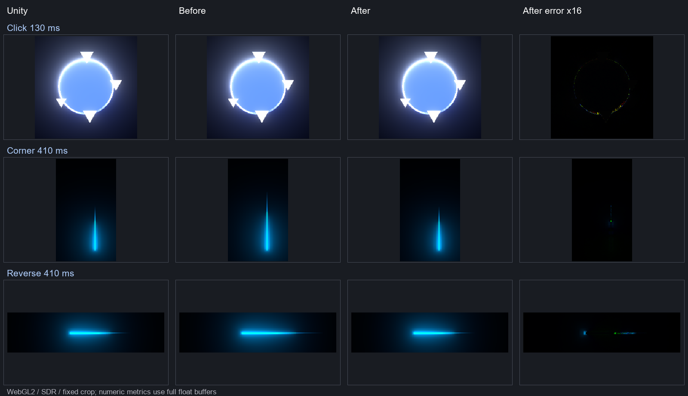

# 第一期 Unity 拟合实测

2026-10-05，本地实现与提交；没有推送或发布。API、类型、同步构造和单文件打包方式保留。

参考：UnityMouseFxLab / Unity 2021.3.45f1；Edge 149.0.4022.69，1950×1097、DPR 1、黑底、SDR。两次新采集各自运行两个独立 Unity 图形进程，状态和像素重复一致；前后 434 个参考缓冲也逐字节一致。

原工程 SHA-256：`ab260b1605beb5b9616a62a46f26595be4a1b96d94c9d237ffae68441039f633`。完整参考、网页浮点缓冲和逐层指标保留在独立的 `test-results/unity-comparison-fit-before` / `unity-comparison-fit-after` 中。旧 stage11/stage12 目录保留。

## 同状态拖尾

下表是最终 SDR 合成层。前景 MAE 使用 Unity、旧版和新版的相同并集区域，阈值 1/255；黑色背景不参与该前景指标。

| 410 ms 样本 | 后端 | RGB 总量差：旧 → 新 | MAE 降幅 | 前景 MAE：旧 → 新 |
|---|---|---|---|---|
| 直角 | webgl2 | 17.517% → 0.085% | 98.777% | 3.6946e-3 → 4.4832e-5 |
| 直角 | webgpu | 20.483% → 3.192% | 84.313% | 4.2788e-3 → 6.7023e-4 |
| 折返 | webgl2 | 17.969% → 0.254% | 98.042% | 4.6626e-3 → 9.1274e-5 |
| 折返 | webgpu | 18.799% → 1.112% | 93.701% | 4.8647e-3 → 3.0678e-4 |

两个样本均达到 WebGL2 ≤1%、WebGPU ≤5% 和 MAE 下降 ≥75% 的同状态目标。插值端点由 JS 根据输入时间与寿命计算，Unity BakeMesh 只作参考。

## JS 自行推进的完整生命周期

| 路径 | 全历史最大旧端偏差 | Unity / JS 消失时刻 | 可见性错配 |
|---|---|---|---|
| fixed | 0.000014 px | 310 / 310 ms | 0 |
| corner | 0.000642 px | 440 / 440 ms | 0 |
| reverse | 0.001287 px | 440 / 440 ms | 0 |

公共指针 API 输入相同事件，由生产虚拟时钟和拖尾更新函数自行推进，不注入 Unity 点集。首次移动时初始两端同批出生；释放后头部宽度为零仍属于可见拖尾。寿命边界、全部过期、停顿后重新移动、暂停恢复和取消另有运行时检查。

## 点击与圆环

圆环几何验收以线性 HDR 场景层 `00_UI_HDR` 为主，同时报告最终合成，避免把 Bloom/SDR 误差混入几何结论。

| 时刻 | 后端 | 场景层 MAE / RMSE 降幅 | 最终合成 MAE / RMSE 降幅 |
|---|---|---|---|
| 50 ms | webgl2 | 22.260% / 15.915% | -41.281% / 33.588% |
| 50 ms | webgpu | 22.260% / 15.915% | -41.631% / 33.581% |
| 100 ms | webgl2 | 53.373% / 75.858% | 61.088% / 65.451% |
| 100 ms | webgpu | 53.369% / 75.858% | 62.288% / 65.654% |
| 120 ms | webgl2 | 60.671% / 83.693% | 81.050% / 55.682% |
| 120 ms | webgpu | 60.664% / 83.691% | 84.528% / 55.791% |
| 130 ms | webgl2 | 59.110% / 83.918% | 62.085% / 67.714% |
| 130 ms | webgpu | 59.108% / 83.919% | 66.074% / 67.949% |
| 250 ms | webgl2 | 70.669% / 71.615% | 74.114% / 33.345% |
| 250 ms | webgpu | 70.661% / 71.615% | 76.310% / 33.371% |
| 450 ms | webgl2 | 31.865% / 21.205% | 8.563% / 7.909% |
| 450 ms | webgpu | 31.870% / 21.210% | 8.188% / 7.881% |

130 ms 的场景与最终层 MAE、RMSE 均下降超过 50%，其余点击场景层也改善。**50 ms 的最终合成 MAE 上升约 41%，未达到“其他点击误差增幅 ≤5%”的完整合成目标**，即使该样本场景层和最终 RMSE 改善，也不能计为完整达标。450 ms 仍有约 1.8% RGB 总量不足。

针对 50 ms 的额外诊断只在验收夹具中分别使用原始 BakeMesh 坐标/UV、改用先减中心的投影计算，最终 MAE 仍约为 9.27e-6 / 9.26e-6，未消除回归。两种诊断都未进入生产代码，不能据此确认剩余误差的根因；需要继续隔离各合成阶段。

## 仍未解决的差异

JS 自行输入的 410 ms 拖尾最终 RGB 总量差如下；端点和消失时刻达标不代表整条拖尾像素一致。网页采样密度与 Unity 不同，颜色插值是需要进一步隔离确认的误差因素。

| 路径 | WebGL2 | WebGPU |
|---|---|---|
| corner | -9.107% | -5.888% |
| reverse | -8.853% | -7.972% |

点击随机数、运动模拟、Native 扩散模型及 HDR 专项校准没有在本期调整；本次实测不证明这些部分完整复刻。Native 的 48 组数值黄金记录保持一致，Canvas/Native 默认内部积分保留原精度。

## 运行成本

七轮 CPU 微基准取中位数，同机前后依次运行。耗时包含浏览器调度噪声，不代表 GPU FPS；静止轨迹仅复用缓存，移动轨迹包含连续裁切和几何重建。

| 工作 | 旧版 ms/次 | 新版 ms/次 | 变化 |
|---|---|---|---|
| rings | 0.0092000 | 0.0042000 | -54.348% |
| fixedTrail | 0.0000201 | 0.0000327 | 62.687% |
| changingTrail | 0.2650000 | 0.2860000 | 7.925% |

默认双圆环顶点数据从 62,856 降至 9,360 字节（约 -85.1%），索引数据从 36,864 降至 3,072 字节（-91.7%）。移动拖尾有持续重建的成本；静止点集缓存避免每帧扫描全部采样。

日志时间记录：Unity 两轮约 203.4 / 37.4 秒，网页完整重放约 613.4 秒，最终发布检查约 129.1 秒。网页重放包含浮点回读、压缩、PNG 与指标计算，且曾与其他验证共享本机；不能当作渲染帧率。

## 对照图与验证

下图从固定坐标区域裁切，统一缩放用于观察；不参与指标计算。列顺序为 Unity、旧版、新版、新版差异放大 16 倍。

完整分层 RGB 总量与误差见 [指标 JSON](unity-fit-stage1-metrics.json)。本机完成 `npm run check:release`、`verify:unity-reference` 和真实 Unity 分层对照。浏览器覆盖 DPR 1/2、灰底/白底与连续性、公共 API、暂停/恢复/取消、自定义采样/宽度/旋转/溶解方向。WebGPU 实际运行，设备没有跳过。视觉基线在确认 Unity 场景误差下降之后更新；50 ms 最终合成回归仍在本报告中明确保留。

复现报告：`node scripts/report-unity-fit.mjs`。微基准：`node scripts/benchmark-runtime.mjs unity-fit-after /src/ --fit-only`，旧版替换为冻结源码前缀。
